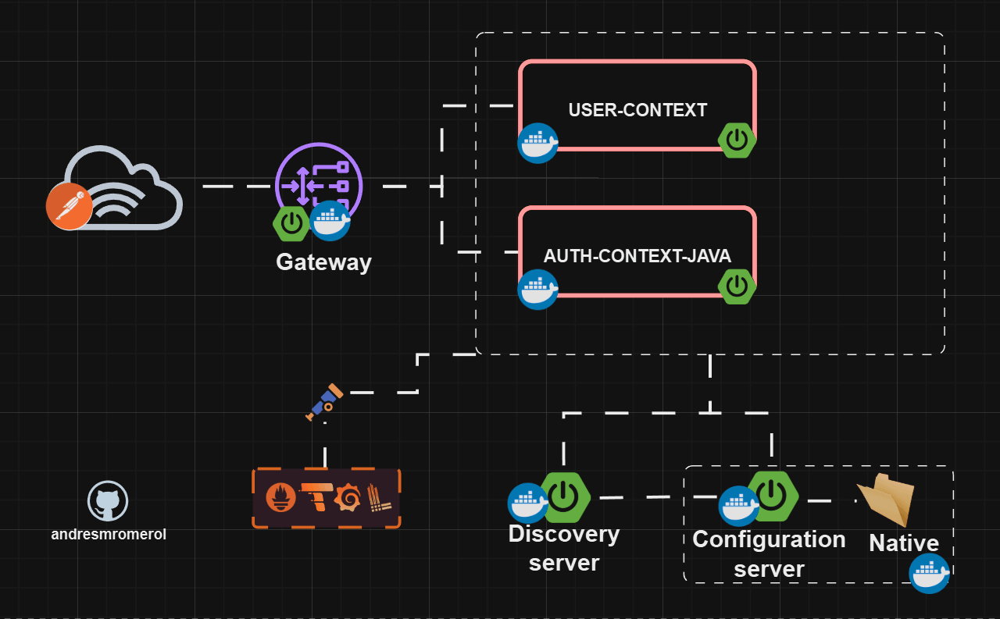
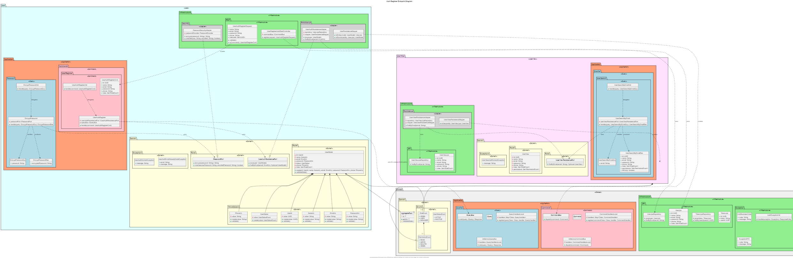
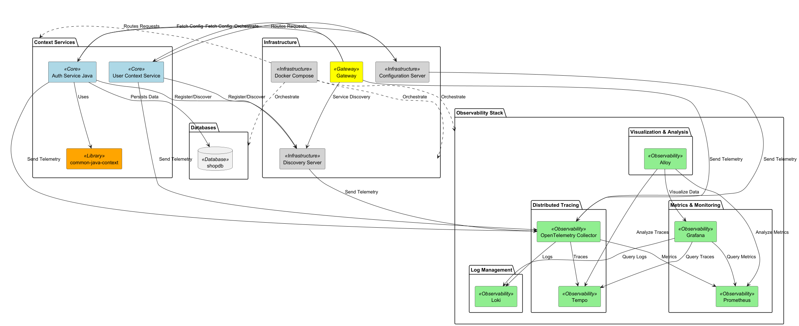
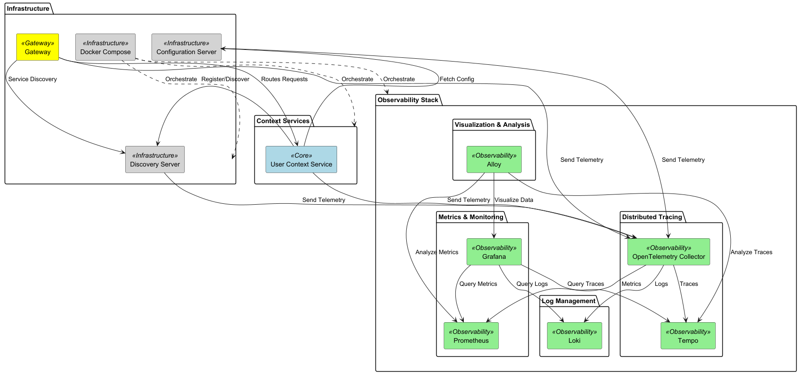

# microservices-architectures-patterns-testing-ddd-events-eda-cqrs-saga-cicd-docker-kubernetes

# 🔷  Project view

# 🔷 Branches

##  🌵 3-feat/add-user-registration-auth

### [View auth-register-endpoint-diagram.plantuml](./uml/auth-register-endpoint-diagram.plantuml)

⚡️Create shared classes in common-java-context.   
⚡️ Implement Onion Architecture for better separation of concerns. 
⚡️Apply Domain Driven Design principles to structure the project. 
⚡️Add command and query bus for CQRS. 
⚡️Define the user and user_vw aggregates. 
⚡️Create the UserAuthRegister command and EncryptPassword query along with the ports: IPasswordPort and IUserAuthPersistencePort under the user domain. 
⚡️Add the UserSearchByEmail query and IUserViewPersistencePort port in the user_vw domain. 
⚡️Create a centralized exception controller. 
⚡️Integration to monitoring tools for better observability. 
⚡️create PUT endpoint athj_user_register in postman_collection. 

##  🌵 2-feat/initialize-auth-service-java

### [View microservices-component-diagram](./uml/microservices-component-diagram.puml)

##  🌵 1-feat/add-configuration-discovery-gateway-observability-monitoring

### [View microservices-component-diagram](./uml/microservices-component-diagram.puml)

