# microservices-architectures-patterns-testing-ddd-events-eda-cqrs-saga-cicd-docker-kubernetes

# 🔷  Project view

# 🔷 Branches

##  🌵 8-feat/gateway-authorization-routes-and-header-config

### [View gateway-module-diagram.plantuml](./uml/8-gateway-module-diagram.plantuml)
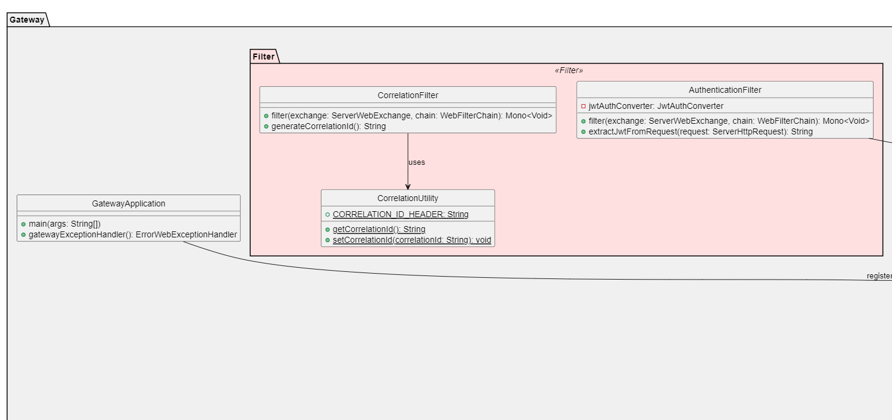
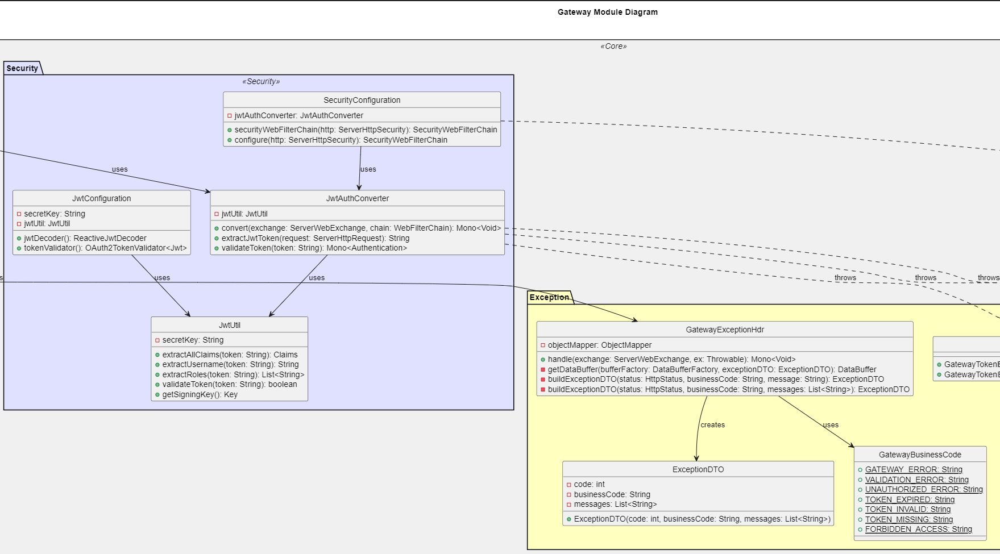
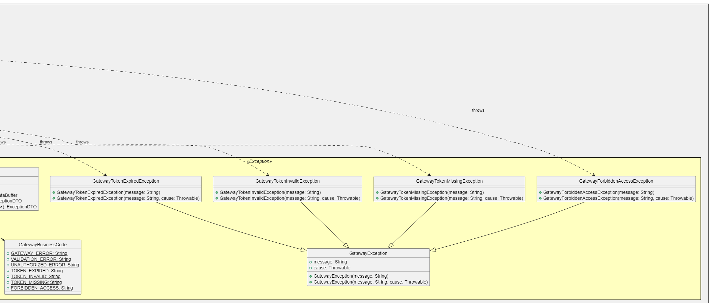

⚡️Add exceptions: GatewayException, GatewayForbiddenAccessException, GatewayTokenExpiredException, GatewayTokenInvalidException, and GatewayTokenMissingException. 
⚡️Configure authentication and authorization for the routes in the microservices system. 

##  🌵 7-feat/add-refresh-token-auth

### [View auth-refresh-token-endpoint-diagram.plantuml](./uml/7-auth-refresh-token-endpoint-diagram.plantuml)
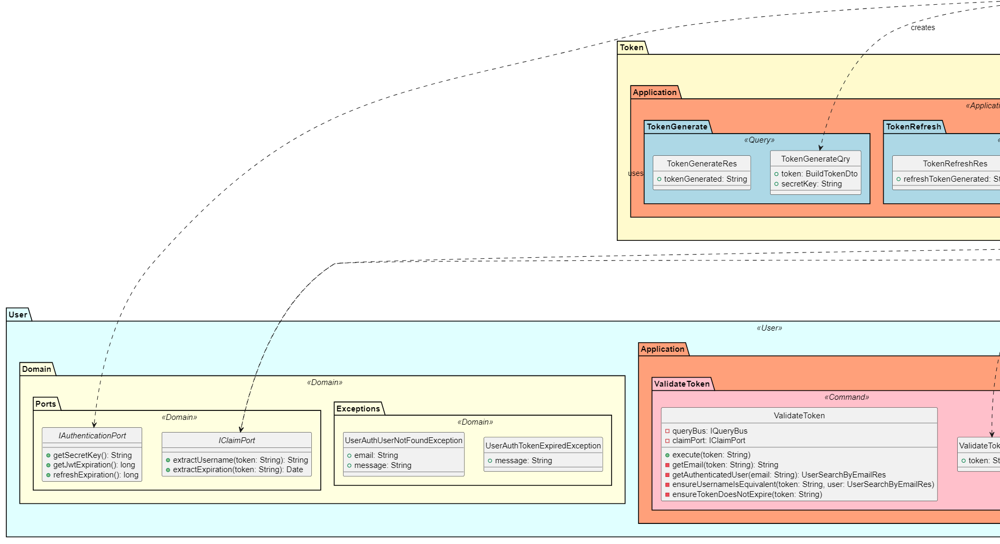
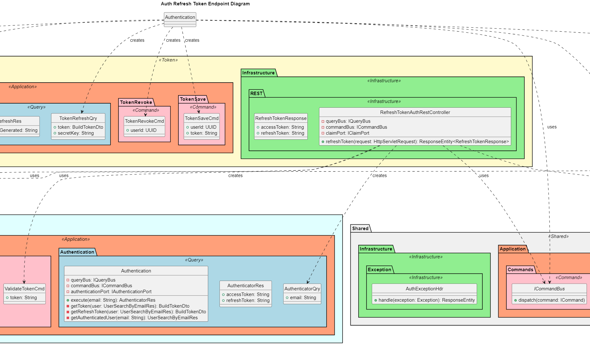
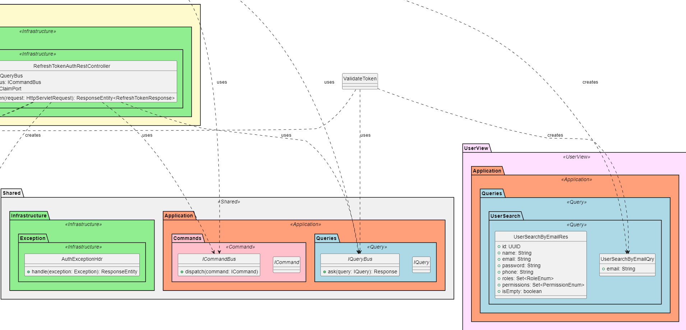

⚡️Add command: ValidateToken. 
⚡️Add POST athj_refresh_token to postman_collection. 
⚡️Add exception: UserAuthTokenExpiredException. 

##  🌵 6-feat/add-logout-auth

### [View auth-logout-diagram.plantuml](./uml/6-auth-logout-diagram.plantuml)
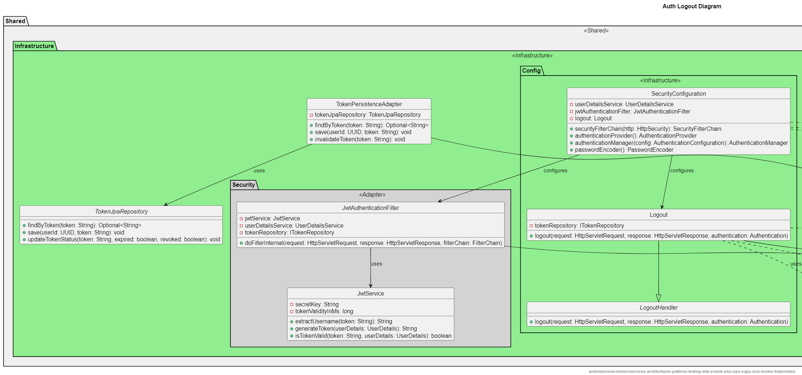

⚡️Add commands: ChangePassword and UserUpdate. 
⚡️Add custom Logout handler extending LogoutHandler. 
⚡️Add POST athj_logout endpoint to postman_collection. 
⚡️Update SecurityConfiguration. 
⚡️Update TokenJpaRepository. 
⚡️Add UML class diagram: auth-logout-diagram. 

##  🌵 5-feat/add-change-password-auth

### [View auth-change-password-endpoint-diagram.plantuml](./uml/5-auth-change-password-endpoint-diagram.plantuml)
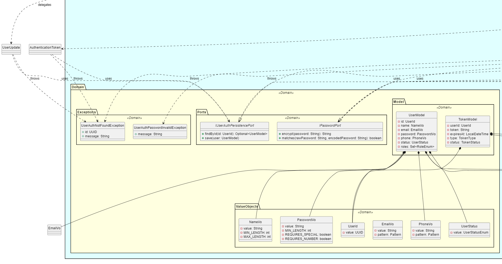
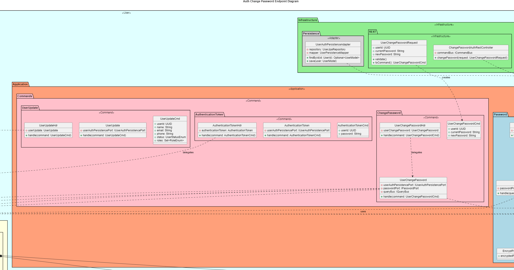
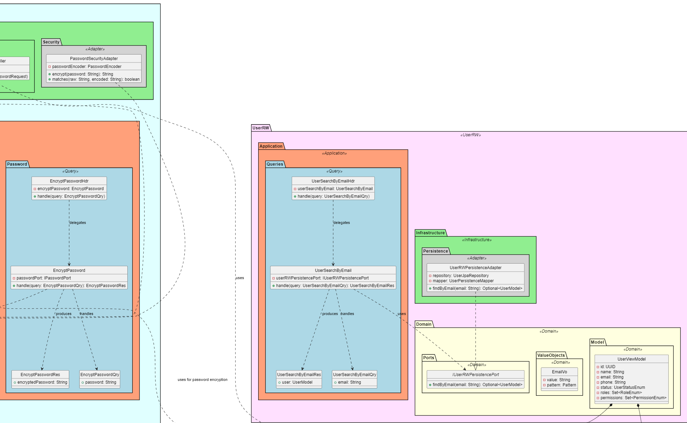
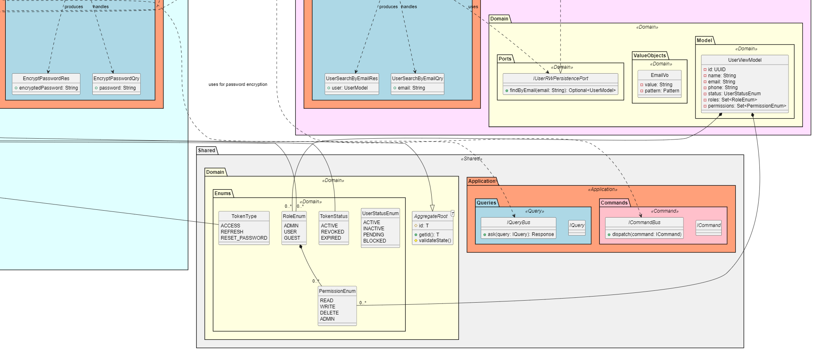

⚡️Add commands: ChangePassword and UserUpdate. 
⚡️Add IClaimPort. 
⚡️Modify ports: IPasswordPort, IUserAuthPersistencePort. 
⚡️Add exceptions: UserAuthNewPasswordConfirmationInvalidException, UserAuthPasswordConfirmationInvalidException. 
⚡️Create endpoint: PUT athj_change_password. 

##  🌵 4-feat/add-user-authentication-endpoint

### [View auth-authenticate-endpoint-diagram.plantuml](./uml/4-auth-authenticate-endpoint-diagram.plantuml)
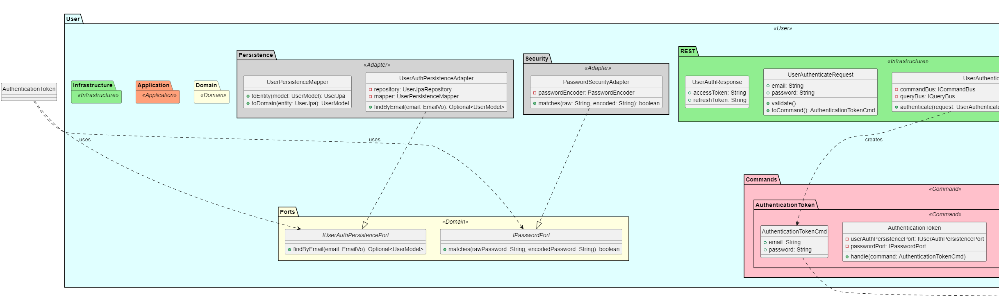
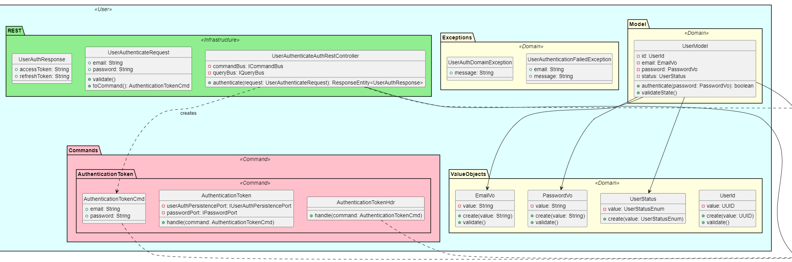
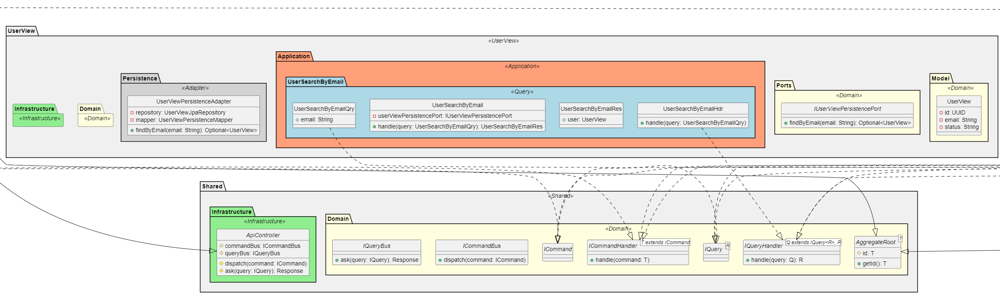
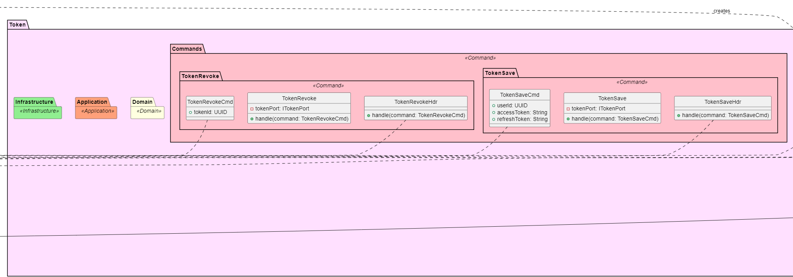
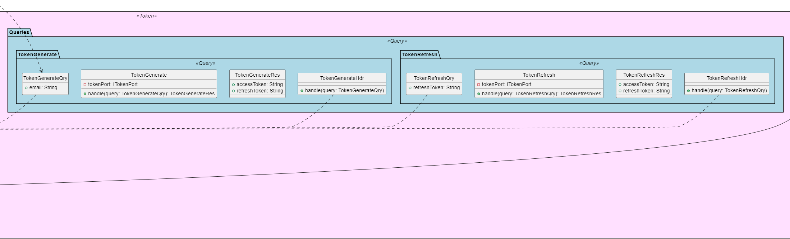
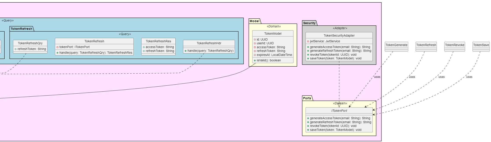

⚡️Add commands: AuthenticationToken, TokenRevoke, and TokenSave. 
⚡️Add queries: UserSearchByEmail, TokenGenerate, and TokenRefresh. 
⚡️Add ports: ITokenPersistencePort, ITokenPort, and IAuthenticationPort. 
⚡️Add exceptions: TokenRevocationFailedException, TokenSaveFailedException, UserAuthUserNotFoundException, and ValidTokenNotFoundException. 
⚡️Create the Token domain. 
⚡️create POST endpoint athj_authenticate in postman_collection. 

##  🌵 3-feat/add-user-registration-auth

### [View auth-register-endpoint-diagram.plantuml](./uml/3-auth-register-endpoint-diagram.plantuml)
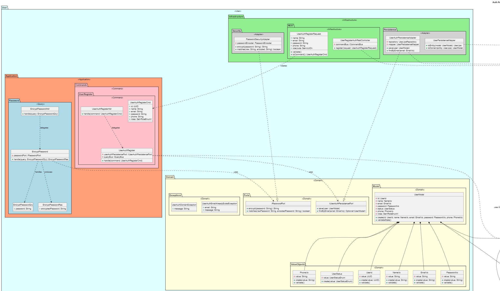
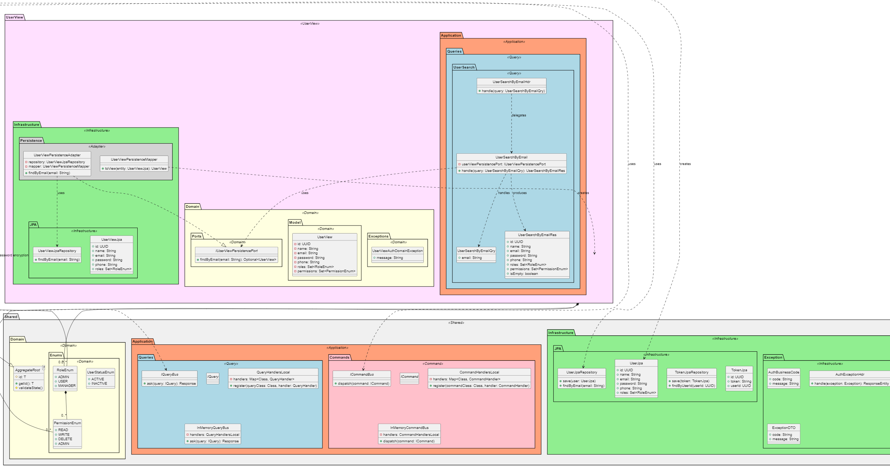

⚡️Create shared classes in common-java-context.   
⚡️ Implement Onion Architecture for better separation of concerns. 
⚡️Apply Domain Driven Design principles to structure the project. 
⚡️Add command and query bus for CQRS. 
⚡️Define the user and user_vw aggregates. 
⚡️Create the UserAuthRegister command and EncryptPassword query along with the ports: IPasswordPort and IUserAuthPersistencePort under the user domain. 
⚡️Add the UserSearchByEmail query and IUserViewPersistencePort port in the user_vw domain. 
⚡️Create a centralized exception controller. 
⚡️Integration to monitoring tools for better observability. 
⚡️create PUT endpoint athj_user_register in postman_collection. 

##  🌵 2-feat/initialize-auth-service-java

### [View microservices-component-diagram](./uml/1-microservices-component-diagram.puml)

##  🌵 1-feat/add-configuration-discovery-gateway-observability-monitoring

### [View microservices-component-diagram](./uml/1-microservices-component-diagram.puml)

